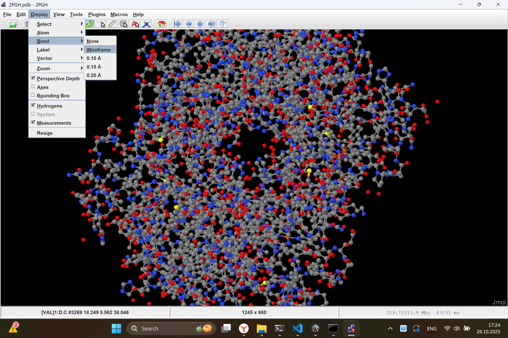
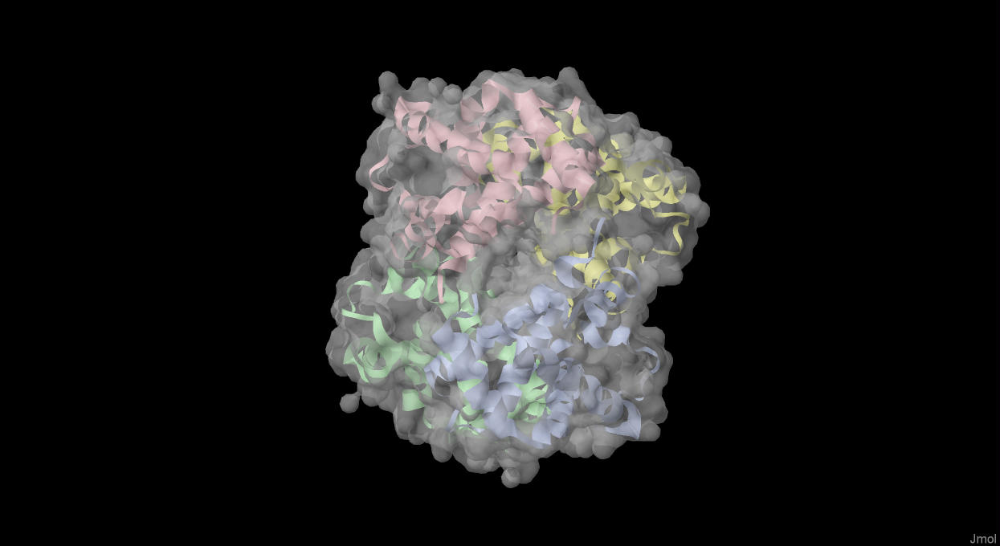

# *Козлов Кирилл*, Биоинформатика-2, Задание 4 - Визуализация структуры белка
## Программа для визуализации
В качестве программы взял [Jmol](https://jmol.sourceforge.net/)

## Выбранный белок
В качестве белка выбрал белок гемоглобина [2PGH](https://www.rcsb.org/structure/2PGH)

## Выполнение работы
Открываем файл `jmol.bat` - у нас открывается приложение.

### Загрузка белка
В меню `File -> Get PDB` вводим код белка `2PGH`, после чего он автоматически подгрузится в программу

### Визуализация
#### Wireframe
Нажимем `Display -> Bond -> Wireframe` либо ПКМ: `Style -> Scheme -> Wireframe`, после чего можем наблюдать структуру связей атомов в белке:

#### Backbone
ПКМ: `Style -> Scheme -> Trace`:

#### Spacefill
Атомы с полями

ПКМ: `Style -> Scheme -> CPK Spacefill`:

#### Ribbons
Ленточная вторичная структура

ПКМ: `Style -> Structures -> Ribbons`

#### Molecular surface
Позволит также отобразить поверхность белка. Наложу поверх ленточной структуры

ПКМ: `Surfaces -> Molecular surface`

### Окраска
#### CPK
На самом деле, это та модель окраски, которая видна по умолчанию, но если вдруг к ней надо вернуться после отображения других видов, то надо включить отображения атомов + ПКМ: `Color -> Atoms -> By Scheme -> Element (CPK)`, после чего сможем наблюадть окраску атомов (или их групп) в зависиомсоти от элементов:

#### Окраска по доменам
Включается через ПКМ: `Color -> By Scheme -> Chain`

Можно отчётливо наблюдать 4 домена

## Снимки публикационного качества
С папке [`./export_images/`](./export_images/) можно посмотреть несколько изображений повышенного качества. Также приложу их здесь

