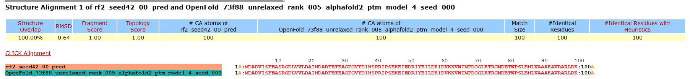
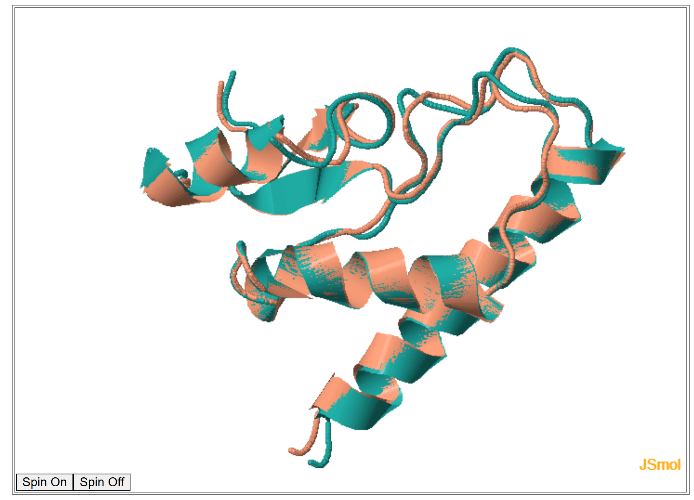

# *Козлов Кирилл*, Биоинформатика-2, Задание 5 - Предсказание и парное выравнивание структур белков
## Исходные данные и программы
Первичная последовательность белка - `MDADVISFEASRGDLVVLDAIHDARFETEAGPGVYDIHSPRIPSEKEIEDRIYEILDKIDVKKVWINPDCGLKTRGNDETWPSLEHLVAAAKAVRARLDK`

Инструменты фолдинга:
- [RoseTTAFold2](https://colab.research.google.com/github/sokrypton/ColabFold/blob/main/RoseTTAFold2.ipynb)
- [OpenFold](https://colab.research.google.com/github/aqlaboratory/openfold/blob/main/notebooks/OpenFold.ipynb)

Инструмент парного выравнивания - [CLICK](https://mspc.bii.a-star.edu.sg/minhn/pairwise.html)

В качестве программы для визаулизации взял [Jmol](https://jmol.sourceforge.net/) из [задания 4](../task_4/README.md)

## Выполнение работы
### Предсказание
- [Результат](./rosetta_X1_73f88/) для RoseTTAFold2
  - [PDB-файл](./rosetta_X1_73f88/rf2_seed42_00_pred.pdb)

*Примечание*: в OpenFold у scipy была не та версия одной из зависимостей, для приведения в рабочее состояние потребовалось исполнить такой фрагмент:
```py
# обновление регистра и установка новой версии зависимости
!add-apt-repository ppa:ubuntu-toolchain-r/test -y
!apt-get update
!apt-get install -y libstdc++6
!ldconfig

# Сбрасываем рантайм (потом надо запускать всё снова, желательно ещё перезагрузиться)
import os
os.kill(os.getpid(), 9)
```
Вероятно в [новой версии](https://colab.research.google.com/github/vaclavhanzl/openfold/blob/colab-add-dep-fix-python-version/notebooks/OpenFold.ipynb) проблема уже решена, но я решил ограничиться своим фиксом

Позже выяснилось, что обе версии OpenFold требуют CUDA, которая вовсе недоступна в Google Colab, поэтому перешёл на [AlphaFold]()

- [Результат](./AlphaFold/) для AlphaFold
  - [PDB-файл](./AlphaFold/OpenFold_73f88_unrelaxed_rank_002_alphafold2_ptm_model_1_seed_000.pdb)

### Парное выравнивание


[Файл выравнивания](./pair/pair.pir)

### CLICK сразу использует Jmol, поэтому выгружать его туда для отдельной визуализации посчитал нецелесообразным


### Выводы
Предсказания пересекаются на 100% и имеют идеальный скор. Вероятнее всего это вызвано тем, что предсказание для этого белка уже имеется в общедоступных базах данных, однако на визуализации можно заметить, что расположение цепочек немного отличается, что можно наблюдать по среднеквадратичному отклонению